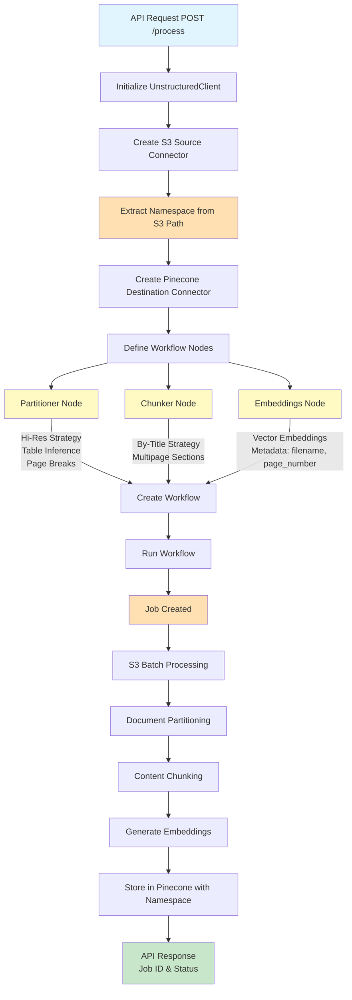

# FastUnstruct API

A high-performance Flask application (wrapped with FastAPI for production) for processing and extracting structured data from documents using **Unstructured Workflow Endpoint**, with seamless S3 and Pinecone integration. Features automatic vector embeddings for semantic search with intelligent namespace management. Production-ready with modern workflow architecture.

## ✨ Features

- **Workflow Endpoint**: Uses Unstructured's modern workflow API with job-based processing
- **Batch Processing**: Process multiple documents efficiently from S3 buckets
- **Advanced Partitioning**: Hi-res document partitioning with table structure inference
- **Smart Chunking**: By-title chunking strategy with multipage sections
- **Vector Embeddings**: Automatic embedding generation for vector search with Pinecone
- **Smart Namespacing**: S3 folder paths automatically mapped to Pinecone namespaces
- **Rich Metadata**: Includes document name, page numbers, and file type in vector metadata
- **S3 Integration**: Dynamic S3 source connectors for AWS document access
- **Pinecone Integration**: Automated destination connectors with namespace isolation
- **RESTful API**: Simple and intuitive API endpoints
- **Job Status Polling**: Automatic polling with configurable timeout (default: 1 hour)
- **Webhook Notifications**: Real-time HTTP callbacks on job completion
- **Production Ready**: SOC2 compliant with enterprise-grade features
- **Cost Optimized**: Built-in logic for best quality/cost ratio
- **Asynchronous Jobs**: Non-blocking workflow execution with optional synchronous polling
- **Hybrid Architecture**: Flask core with FastAPI ASGI wrapper for production deployment

## 🏗️ Architecture

### Application Stack

The application uses a **hybrid Flask + FastAPI architecture**:
- **Core Application**: Built with Flask for its simplicity and async support
- **Production Wrapper**: FastAPI wraps the Flask app via ASGI middleware for better performance
- **Benefits**: Combines Flask's simplicity with FastAPI's production-ready ASGI performance

### Workflow Architecture

This application uses the **Unstructured Workflow Endpoint** architecture, which provides production-ready document processing with better performance and cost optimization compared to the legacy partition endpoint.



### How It Works

1. **Source Connector**: Creates a dynamic S3 connector with your AWS credentials to access documents
2. **Namespace Extraction**: Automatically extracts namespace from S3 folder path (e.g., `s3://bucket/docs/legal/` → `docs-legal`)
3. **Destination Connector**: Creates a Pinecone connector with the extracted namespace for organized vector storage
4. **Workflow Nodes**:
   - **Partitioner**: Extracts structured content using hi-res strategy with table inference
   - **Chunker**: Splits content into semantic chunks using by-title strategy
   - **Embeddings**: Generates vector embeddings for semantic search with metadata (filename, page_number, filetype, element_id)
5. **Job Execution**: Runs the workflow asynchronously and returns job information
6. **Batch Processing**: Processes all files in the S3 folder recursively
7. **Vector Storage**: Embeddings are stored in Pinecone with namespace isolation for organized retrieval

### Migration from Partition Endpoint

This application was migrated from the deprecated partition endpoint to the workflow endpoint. See [WORKFLOW_MIGRATION.md](WORKFLOW_MIGRATION.md) for details.

**Key Differences:**
- ✅ Uses `unstructured-client` SDK (not `unstructured-ingest`)
- ✅ Production endpoint: `https://platform.unstructuredapp.io/api/v1`
- ✅ Job-based asynchronous processing (not synchronous)
- ✅ Better performance with latest vision transformer models
- ✅ Cost-optimized with intelligent routing

## 🚀 Quick Start

### Prerequisites

- Python 3.8+
- pip (Python package manager)
- AWS credentials (for S3 access)
- Unstructured.io API key (get one at [platform.unstructured.io](https://platform.unstructured.io))
- Pinecone account and API key (get one at [pinecone.io](https://www.pinecone.io))
- Pinecone index (serverless or pod-based)

## 🛠 Local Development

### 1. Clone the repository

```bash
git clone https://github.com/KevinDyerAU/fastunstructapi.git
cd fastunstructapi
```

### 2. Set up a virtual environment

#### Windows:
```bash
python -m venv venv
.\venv\Scripts\activate
```

#### macOS/Linux:
```bash
python3 -m venv venv
source venv/bin/activate
```

### 3. Install dependencies

```bash
pip install -r requirements.txt
```

### 4. Configure environment variables

Create a `.env` file in the root directory with the following variables:

```env
# Flask Configuration
FLASK_APP=wsgi:app
FLASK_ENV=development
PORT=8080

# AWS Configuration
AWS_ACCESS_KEY_ID=your_aws_access_key
AWS_SECRET_ACCESS_KEY=your_aws_secret_key

# Unstructured.io Configuration
UNSTRUCTURED_API_KEY=your_unstructured_api_key

# Pinecone Configuration
PINECONE_API_KEY=your_pinecone_api_key
PINECONE_INDEX_NAME=your_index_name
```

### 5. Run the development server

```bash
python main.py
```

The API will be available at `http://localhost:8080`

## 🚀 Deployment

### Render (Recommended)

This project includes a `render.yaml` blueprint for easy deployment.

#### Option 1: Deploy with Render Blueprint
[](https://render.com/deploy?repo=https://github.com/KevinDyerAU/fastunstructapi)

1. Click the "Deploy to Render" button above
2. The `render.yaml` file will automatically configure the service
3. Add your environment variables in the Render dashboard:
   - `AWS_ACCESS_KEY_ID`: Your AWS access key
   - `AWS_SECRET_ACCESS_KEY`: Your AWS secret key
   - `UNSTRUCTURED_API_KEY`: Your Unstructured.io API key
   - `PINECONE_API_KEY`: Your Pinecone API key
   - `PINECONE_INDEX_NAME`: Your Pinecone index name
4. Deploy!

#### Option 2: Manual Render Setup
1. Fork this repository
2. Create a new Web Service on Render
3. Connect your GitHub repository
4. Use the following settings:
   - **Build Command**: `pip install -r requirements.txt`
   - **Start Command**: `uvicorn asgi:app --host 0.0.0.0 --port $PORT --workers 4 --timeout-keep-alive 240`
5. Add the environment variables listed above
6. Deploy!

### Manual Deployment

1. Clone the repository
2. Set up a Python virtual environment
3. Install dependencies: `pip install -r requirements.txt`
4. Set environment variables (see Configuration section)
5. Run with Gunicorn: `gunicorn wsgi:app --worker-class=uvicorn.workers.UvicornWorker --workers=4 --timeout 240 --bind 0.0.0.0:$PORT`

## 🌐 API Endpoints

### Root Endpoint

Check if the API is running:

```http
GET /
```

**Response:**
```json
{
  "status": "success",
  "message": "FastUnstruct API is running"
}
```

### Health Check Endpoint

Health check endpoint for monitoring and load balancers (available in production with FastAPI wrapper):

```http
GET /health
```

**Response:**
```json
{
  "status": "ok"
}
```

### Process Documents (Workflow Endpoint)

Process documents from S3 using the Unstructured Workflow Endpoint:

```http
POST /process
Content-Type: application/json

{
  "fileName": "s3://bucket-name/folder/path/",
  "awsK": "your_aws_access_key",
  "awsS": "your_aws_secret_key",
  "unstrK": "your_unstructured_api_key",
  "pineconeK": "your_pinecone_api_key",
  "pineconeIndex": "your_pinecone_index_name",
  "waitForCompletion": true,
  "webhookUrl": "https://your-webhook-endpoint.com/notify"
}
```

**Parameters:**
- `fileName` (string, required): S3 path to folder or file (e.g., `s3://my-bucket/documents/legal/`)
  - The folder path is automatically converted to a Pinecone namespace (e.g., `documents-legal`)
- `awsK` (string, required): AWS access key for S3 access
- `awsS` (string, required): AWS secret access key
- `unstrK` (string, required): Unstructured API key from [platform.unstructured.io](https://platform.unstructured.io)
- `pineconeK` (string, required): Pinecone API key
- `pineconeIndex` (string, required): Pinecone index name
- `waitForCompletion` (boolean, optional): Wait for job completion with polling (default: `true`)
  - If `true`, API waits up to 1 hour for job completion
  - If `false`, returns immediately with job ID
- `webhookUrl` (string, optional): URL to receive webhook notifications on job completion
  - Webhook payload includes job status, elapsed time, namespace, and S3 path

**Success Response (with waitForCompletion=true):**
```json
{
  "status": "success",
  "message": "File s3://bucket-name/folder/path/ processed successfully",
  "result": {
    "job_id": "job_abc123",
    "status": "completed",
    "elapsed_seconds": 245
  }
}
```

**Success Response (with waitForCompletion=false):**
```json
{
  "status": "success",
  "message": "File s3://bucket-name/folder/path/ processed successfully",
  "result": {
    "job_id": "job_abc123",
    "status": "started",
    "message": "Job started, not waiting for completion"
  }
}
```

**Error Response:**
```json
{
  "status": "error",
  "message": "Error description"
}
```

**Job Polling & Webhooks:**

The API now supports:
- **Automatic Job Polling**: Set `waitForCompletion: true` to automatically poll job status every 10 seconds (up to 1 hour)
- **Webhook Notifications**: Provide a `webhookUrl` to receive HTTP POST notifications when jobs complete

**Webhook Payload Example:**
```json
{
  "event": "workflow_complete",
  "timestamp": 1697520000.123,
  "job_id": "job_abc123",
  "status": "completed",
  "elapsed_seconds": 245,
  "namespace": "documents-legal",
  "s3_path": "s3://bucket/documents/legal/",
  "error": null
}
```

## ⚙️ Configuration

### Environment Variables

| Variable | Description | Required |
|----------|-------------|----------|
| `AWS_ACCESS_KEY_ID` | AWS access key | Yes |
| `AWS_SECRET_ACCESS_KEY` | AWS secret key | Yes |
| `UNSTRUCTURED_API_KEY` | Unstructured.io API key | Yes |
| `PINECONE_API_KEY` | Pinecone API key | Yes |
| `PINECONE_INDEX_NAME` | Pinecone index name | Yes |
| `PORT` | Port to run the server on | No (default: 8080) |
| `FLASK_ENV` | Environment (development/production) | No (default: production) |

## 📊 Project Structure

```
fastunstructapi/
├── main.py                    # Main Flask application with workflow endpoint logic
├── wsgi.py                    # WSGI/ASGI entry point for production (FastAPI wrapper)
├── asgi.py                    # Alternative ASGI entry point
├── requirements.txt           # Python dependencies
├── render.yaml                # Render deployment configuration
├── .env                       # Environment variables (local development)
├── .gitignore                 # Git ignore file
├── README.md                  # This file
└── WORKFLOW_MIGRATION.md      # Migration guide from partition endpoint
```

## 🔧 Troubleshooting

### Common Issues

**Authentication Errors**
- Verify your Unstructured API key at [platform.unstructured.io](https://platform.unstructured.io)
- Ensure the API key is passed correctly in the request

**S3 Connection Issues**
- Verify AWS credentials have read permissions on the S3 bucket
- Check the S3 path format: `s3://bucket-name/path/`
- Ensure the AWS region is accessible

**Pinecone Connection Issues**
- Verify Pinecone API key is correct
- Ensure the Pinecone index exists and is active
- Check index dimensions match the embedding model (1536 for text-embedding-ada-002)
- Verify your Pinecone plan supports the index type (serverless or pod-based)

**Job Not Completing**
- Jobs run asynchronously - they may take time to complete
- Check job status at [platform.unstructured.io](https://platform.unstructured.io)
- Review console logs for connector and workflow IDs

**Character Encoding Errors**
- Ensure your terminal supports UTF-8
- Set `PYTHONIOENCODING=utf-8` in your environment

## 🔍 Vector Search with Pinecone Namespaces

The workflow automatically generates vector embeddings and organizes them using **namespace isolation** based on your S3 folder structure.

### Namespace Mapping

The S3 folder path is automatically converted to a Pinecone namespace:

**Examples:**
- `s3://my-bucket/documents/legal/` → Namespace: `documents-legal`
- `s3://my-bucket/docs/hr/policies/` → Namespace: `docs-hr-policies`
- `s3://my-bucket/data/` → Namespace: `data`
- `s3://my-bucket/` → Namespace: `default`

**Namespace Rules:**
- Automatically extracts folder path after bucket name
- Converts to lowercase
- Replaces spaces and underscores with hyphens
- Joins folder levels with hyphens

### Setting Up Your Pinecone Index

1. **Create a Pinecone index** at [app.pinecone.io](https://app.pinecone.io):
   - **Dimensions**: 1536 (for OpenAI text-embedding-ada-002)
   - **Metric**: Cosine similarity
   - **Cloud/Region**: Choose based on your location

2. **Metadata included with embeddings**:
   - `filename`: Source document name
   - `page_number`: Page number in the original document
   - `filetype`: Document type (PDF, DOCX, etc.)
   - `element_id`: Unique identifier for the text element

### Querying Vectors by Namespace

Use the Pinecone Python SDK to query specific namespaces:

```python
import pinecone
from pinecone import Pinecone

# Initialize Pinecone
pc = Pinecone(api_key="your_api_key")
index = pc.Index("your_index_name")

# Query a specific namespace
results = index.query(
    vector=query_embedding,  # Your query vector
    top_k=10,
    namespace="documents-legal",  # Target specific namespace
    include_metadata=True
)

# Access results with metadata
for match in results['matches']:
    print(f"File: {match['metadata']['filename']}")
    print(f"Page: {match['metadata']['page_number']}")
    print(f"Score: {match['score']}")
```

### Benefits of Namespace Isolation

- **Organized Storage**: Keep different document collections separate
- **Efficient Queries**: Search within specific document categories
- **Multi-tenant Support**: Isolate data by customer, project, or department
- **Cost Optimization**: Query only relevant subsets of your data

### Embedding Model

- **Model**: OpenAI `text-embedding-ada-002` (1536 dimensions)
- **Provider**: Managed through Unstructured API
- **Cost**: Optimized for quality/cost ratio
- **Performance**: High-quality semantic search with low latency

## 🤝 Contributing

1. Fork the repository
2. Create a feature branch (`git checkout -b feature/AmazingFeature`)
3. Commit your changes (`git commit -m 'Add some AmazingFeature'`)
4. Push to the branch (`git push origin feature/AmazingFeature`)
5. Open a Pull Request

## 🧪 Testing

To test the API locally:

```bash
# Start the development server
python main.py

# Test the root endpoint
curl http://localhost:8080/

# Test the process endpoint (with job polling)
curl -X POST http://localhost:8080/process \
  -H "Content-Type: application/json" \
  -d '{
    "fileName": "s3://your-bucket/documents/legal/",
    "awsK": "your_aws_key",
    "awsS": "your_aws_secret",
    "unstrK": "your_unstructured_key",
    "pineconeK": "your_pinecone_api_key",
    "pineconeIndex": "your_index_name",
    "waitForCompletion": true
  }'

# Test without waiting (async mode)
curl -X POST http://localhost:8080/process \
  -H "Content-Type: application/json" \
  -d '{
    "fileName": "s3://your-bucket/documents/legal/",
    "awsK": "your_aws_key",
    "awsS": "your_aws_secret",
    "unstrK": "your_unstructured_key",
    "pineconeK": "your_pinecone_api_key",
    "pineconeIndex": "your_index_name",
    "waitForCompletion": false
  }'

# Test with webhook notification
curl -X POST http://localhost:8080/process \
  -H "Content-Type: application/json" \
  -d '{
    "fileName": "s3://your-bucket/documents/legal/",
    "awsK": "your_aws_key",
    "awsS": "your_aws_secret",
    "unstrK": "your_unstructured_key",
    "pineconeK": "your_pinecone_api_key",
    "pineconeIndex": "your_index_name",
    "waitForCompletion": true,
    "webhookUrl": "https://your-webhook-endpoint.com/notify"
  }'
```

**Note:** Testing requires valid AWS, Unstructured, and Pinecone credentials. The S3 folder path (e.g., `documents/legal/`) will be automatically converted to a Pinecone namespace (e.g., `documents-legal`). 

**Job Monitoring:**
- With `waitForCompletion: true`, the API waits up to 1 hour for job completion
- With `waitForCompletion: false`, check job status at [platform.unstructured.io](https://platform.unstructured.io)
- Webhook notifications are sent when jobs complete (success or failure)

## 📚 Additional Resources

- **Unstructured Workflow Endpoint Docs**: [docs.unstructured.io/api-reference/workflow/overview](https://docs.unstructured.io/api-reference/workflow/overview)
- **Migration Guide**: See [WORKFLOW_MIGRATION.md](WORKFLOW_MIGRATION.md) for detailed migration information
- **Unstructured Platform**: [platform.unstructured.io](https://platform.unstructured.io)
- **Unstructured API Key Management**: [platform.unstructured.io](https://platform.unstructured.io) → API Keys
- **Pinecone Documentation**: [docs.pinecone.io](https://docs.pinecone.io)
- **Pinecone Console**: [app.pinecone.io](https://app.pinecone.io)
- **Pinecone Namespaces Guide**: [docs.pinecone.io/guides/indexes/use-namespaces](https://docs.pinecone.io/guides/indexes/use-namespaces)

## 🙏 Acknowledgments

- [Unstructured.io](https://unstructured.io/) for the production-ready workflow endpoint
- [Flask](https://flask.palletsprojects.com/) for the core web framework
- [FastAPI](https://fastapi.tiangolo.com/) for the production ASGI wrapper
- [Render](https://render.com/) for the hosting platform
- [Pinecone](https://www.pinecone.io/) for vector database and semantic search

## 📝 License

This project is licensed under the MIT License.